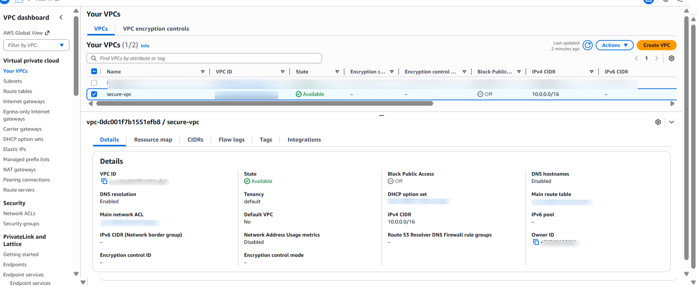
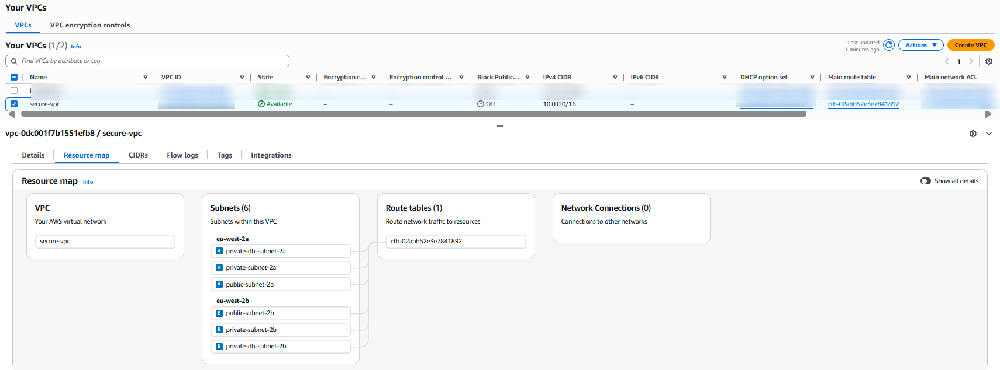

# VPC and Subnets

## Overview

In this part, I'm building the basic network layer for a secure VPC architecture. My goal is to establish a well-organized virtual network. 

The layout of the VPC and subnets is important to the overall architecture. I want to make sure that the structure is clear and predictable, as every routing rule, security measure, and computing resource will depend on it.

## 1. Create the VPC

The following configuration will be used:

- Name: `secure-vpc`
- CIDR Block: `10.0.0.0/16`
- Tenancy: `Default`

A /16 CIDR provides enough address space to carve out multiple subnet tiers (public, private app, private DB) across multiple Availability Zones.

This VPC acts as the isolated network boundary for all resources in the architecture.

## 2. Subnets configuration

The architecture uses 6 subnets, split across two Availability Zones to support higher availability and fault tolerance.

Subnet Tiers

| Tier                | Purpose                 | AZ1 CIDR    | AZ2 CIDR    |
-|-|-|-|
| Public Subnets      | ALB, Bastion Host       | 10.0.1.0/24 | 10.0.2.0/24 | 
| Private App Subnets | EC2 application servers | 10.0.3.0/24 | 10.0.4.0/24 | 
| Private DB Subnets  | RDS database instances  | 10.0.5.0/24 | 10.0.6.0/24 | 

### Public Subnets

- Will be hosting components that are on the internet (ALB, Bastion) 

- Sent through the Internet Gateway

- These subnets can directly connect to the internet and send and receive data.

### Private Application Subnets

- Will be hosting EC2 instances application servers

- There will be no public IPs allowed

- Outbound internet access will be provided via NAT Gateway

- Inbound traffic will be allowed only from ALB or Bastion (depending on the port).

### Private Database Subnets

- Hosting RDS instance

- There will be no internet access (inbound or outbound)

- It will only be reachable from the application layer

### 3. Subnets configuration

- In VPC dashboard select Subnets → Create Subnet then select the VPC created in the step 1: `secure-vpc`

- Choose the appropriate Availability Zone, add the CIDR block and name the subnet according to its tier and AZ

Subnets:

## 4. Importance of the structure

**Security**

- Public and private workloads are kept apart for security

- Databases are completely disconnected from the internet

- Only the ALB and Bastion are accessible from outside

**Scalability**

- It is possible to add more subnets without needing to redesign the VPC.

**Operational Clarity**

- A clear division of responsibilities makes it easier to troubleshoot issues.

- The flow of the network is straightforward and easy to understand.
