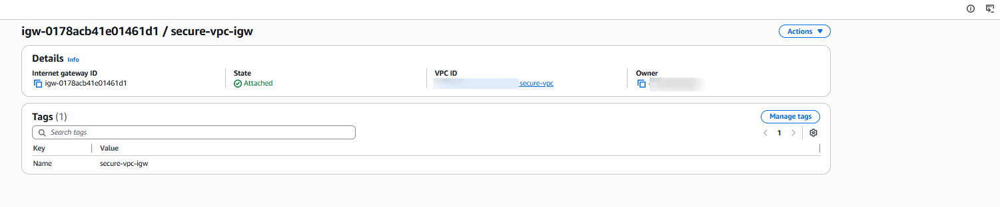
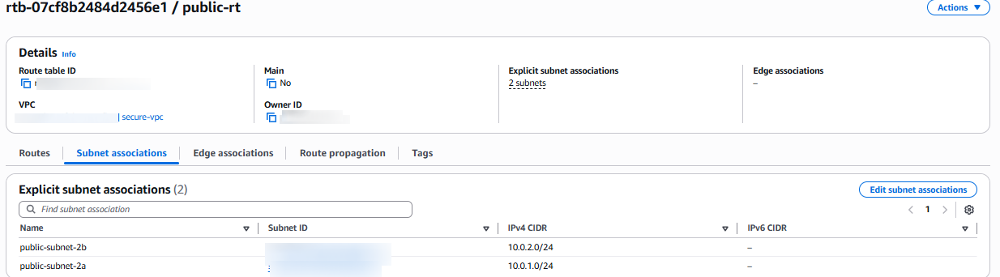
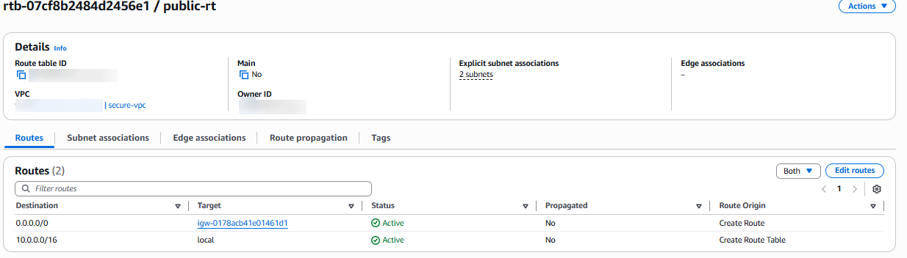
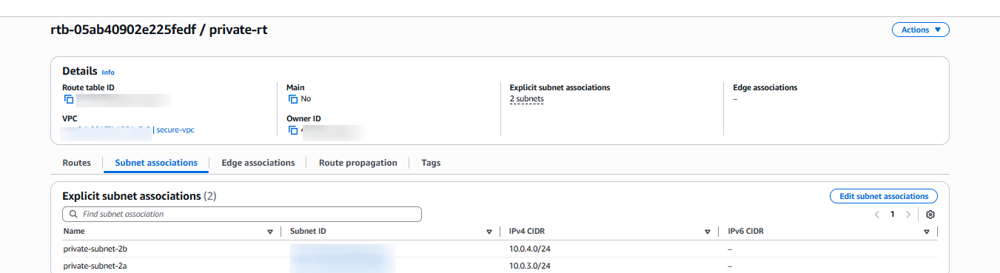
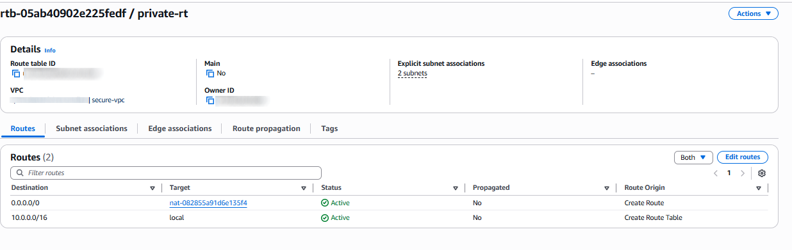

# Routing and Internet Gateways

## Overview

In this section I will be configuring the routing layer of the Secure VPC Architecture. Routing determines how traffic flows between public and private subnets, the internet and internal resources. Correct routing is important for keeping security boundaries and making sure that only the right parts can get to the internet.

This layer will cover:

- Internet Gateway (IGW)

- NAT Gateway

- Public Route Table

- Private Route Table

## 1. Internet Gateway (IGW)

The Internet Gateway will provide:

- Inbound internet access to public subnets

- Outbound internet access for resources with public IPs

- Only public subnets use the IGW.

- Private subnets never route directly to the internet.

Configuration steps:

- In the VPC Dashboard, click on Internet Gateways with a name: `secure-vpc-igw`

- Attached to: `secure-vpc` created earlier.

## 2. NAT Gateway

The NAT Gateway allows private instances to:

- Download OS updates

- Install packages

- Reach external APIs

without exposing them to inbound internet traffic.
This is a core security principle as private resources should never have public IPs.

Configuration steps:

- In the  VPC Dashboard select Nat Gateaway and in a give name: `nat-gateway-az1`, availability mode `regional`

- Subnet: `public-subnet-2a`

- Elastic IP: Allocated during creation

Similar way create another NAT Gateaway `nat-gateway-az2` with subnet `public-aubnet-2b`

## 3. Public Route Table

The following route table is implemented to ensure:

- ALB can receive traffic from the internet

- Bastion host can be accessed via SSH

- Public resources can reach the internet directly

Configuration steps:

- Go to VPC Dashboard selct Route Tables and Create Route Table. Name: `public-rt` and select the VPC created earlier. After the route table creation, associate Subnets:

- `public-subnet-2a`

- `public-subnet-2b`

## 4. Private Route Table

This route table ensures that:

- Private EC2 instances can reach the internet outbound only

- No inbound traffic from the internet is possible

- Application servers remain isolated and secure

The private DB subnets do not require a default route to the internet.

Configuration steps:

- Name: `private-rt`

- Associated Subnets: `private-subnet-2a` and `private-subnet-2b`
 

 

## 5. Why This Routing Model is important

**Security**

- Only public subnets have direct internet access

- Private subnets rely on NAT for outbound traffic

- Databases remain fully isolated

**Operational Clarity**

- We have clear separation of public vs private routing

- It's easier to troubleshoot connectivity issues
