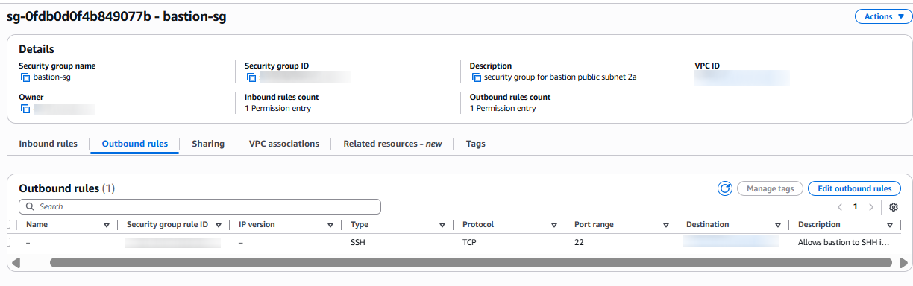
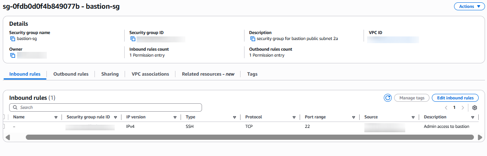
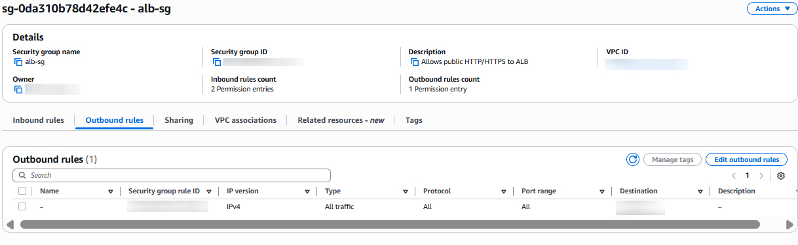
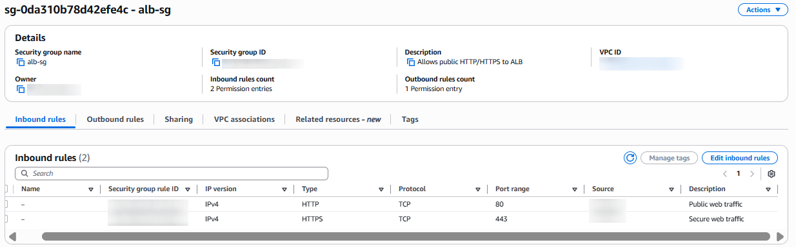

# Bastion Host and Application EC2 Instances

## Overview

This step configures the compute layer of the Secure VPC Architecture and includes:

- A Bastion Host in the public subnet for controlled SSH access

- Private EC2 application servers in the private subnets

- Security groups that enforce strict, least‑privilege communication paths

This layer ensures that no private instance is ever exposed to the internet, while still allowing secure operational access and application traffic

## Configuration of all Required Security Groups

These are three core security groups the architecture needs:

- `bastion-sg`

- `alb-sg`

- `app-servers-sg`

After configuration of EC2, ALB, and Bastion Host we will have the correct traffic rules.

## 1. Bastion Host

The Bastion Host provides a secure entry point for administrators to access private EC2 instances.
It prevents direct SSH access from the internet to private resources.

Instance

- Name: `bastion-host`

- Subnet: `public-subnet-2a`

- Public IP: `Enabled`

- Instance Type: `t2.micro`

- AMI: `Amazon Linux`

Security Group: `bastion-sg`

| Direction | Rule     | Source            | 
-|-|-|
| Inbound   | SSH (22) | `<MY_IP_ADDRESS>` | 
| Outbound  | SSH (22) | `app-servers-sg`  | 

Why this is important:

- Only `<MY_IP_ADDRESS>` can SSH into the bastion

- Bastion can SSH into private EC2 instances

- No other inbound traffic is allowed

- No private instance is ever exposed to the internet

## 2. Application EC2 Instances (Private Subnets)

The following EC2 instances host the application layer and live in private subnets and have no public IPs, they are never reachable from the internet. Traffic reaches them only through the Application Load Balancer (ALB) or the Bastion Host (SSH).

Configuration steps:

EC2 Dashboard -> Launch a new Instance:

- Name: `app-server-1`, `app-server-2`
- Subnets: `private-app-subnet-1` and `private-app-subnet-2`
- Public IP: Disabled
- Instance Type: `t2.micro`
- AMI: Amazon Linux 

Security Group: `app-servers-sg`

| Direction | Rule | Source | 
-|-|-|
| Inbound   | HTTP (80) | alb-sg | 
| Inbound | SSH (22) | `bastion-sg` | 
| Outbound | All | Allowed (default) | 

Why this is important:

- App servers only accept traffic from the ALB

- SSH access is only possible through the Bastion

- No direct internet access

- Outbound internet access is routed through NAT Gateway

## 3. Network Flow Summary

**SSH Access Path**

MY IP → Bastion Host → Private EC2

**Application Traffic Path**

Internet → ALB → Private EC2

**Outbound Internet Path**

Private EC2 → NAT Gateway → Internet

**Database Access Path**

Private EC2 → RDS (private DB subnets)

## 4. Summary

**Security**

- No public IPs on application servers

- SSH restricted to a single trusted IP

- Bastion isolated in its own security group

- ALB is the only public entry point for application traffic

**High Availability**

- App servers deployed across two Availability Zones

- ALB spans both public subnets

**Operational Clarity**

- Clear separation of admin access vs application traffic

- Easy to audit and monitor

- Simple to scale horizontally

